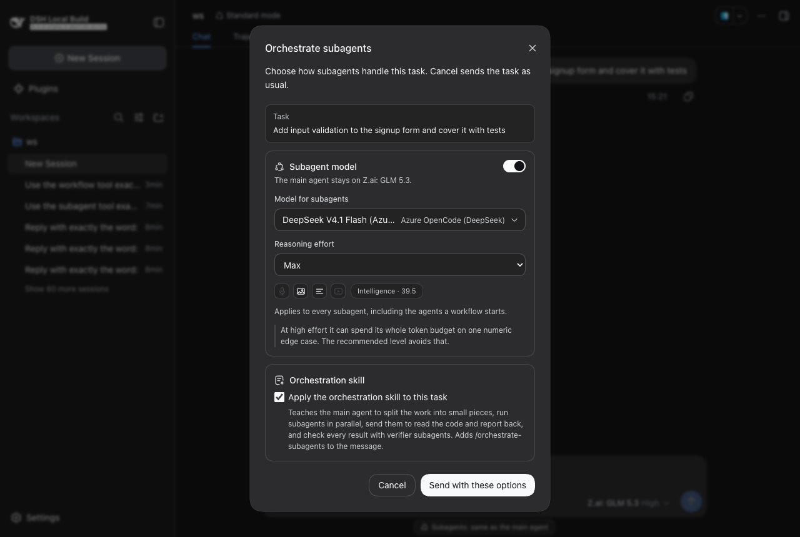
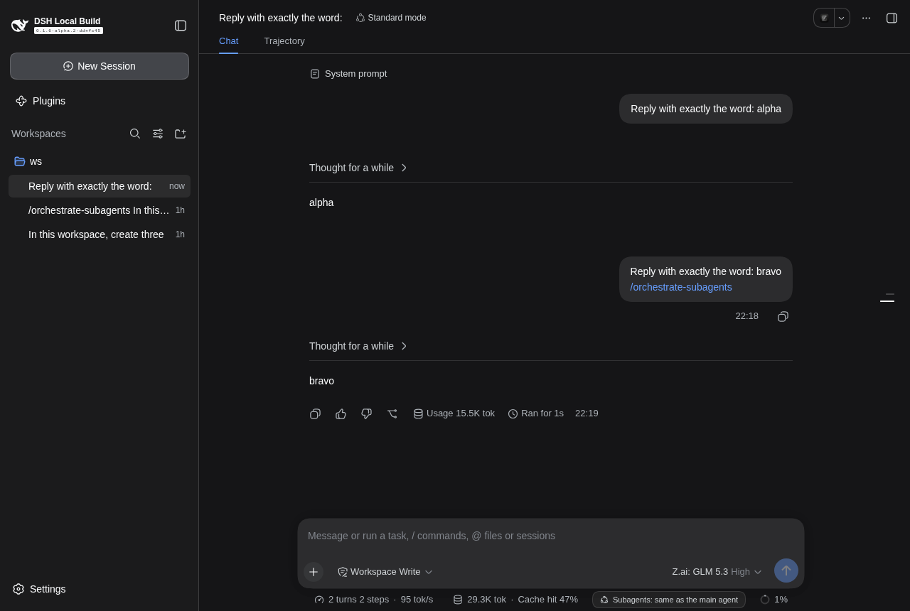
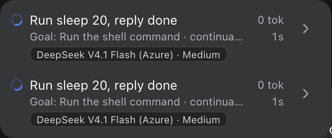

# dsh-orquestrator

[](https://github.com/frederico-kluser/dsh-orquestrator/actions/workflows/ci.yml)
[](LICENSE)

A plugin for [DeepSeek Harness](https://github.com/deepseek-ai) (DSH). When you send a
new task, a dialog in the stock DSH look asks one question:

**Should subagents run on a different model** than the one selected for the main agent?

If yes, you pick the model, and the plugin enforces it **in code**, on every child DSH
starts for that session: the `subagent` tools, but also the agents a `workflow` starts,
`ralph` rounds, one-shot background jobs and agent teams. The main agent cannot talk its way
around it: it is not an instruction to the model, it is the plugin standing in the doors DSH
starts children through. See [Which delegations are covered](#which-delegations-are-covered).

Every governed child also gets a **reasoning-effort ceiling** and an **output-token cap**,
because DSH otherwise runs a re-routed child at its route's default (`max` on many setups):
the cause of subagents that burn their whole budget on one edge case. See
[Reasoning effort](#reasoning-effort).

Since 0.8.0 the plugin also ships a **global agent skill**, `orchestrate-subagents`, and the dialog
carries a checkbox for it, checked by default: when it is checked, the message goes out with
`/orchestrate-subagents` and DSH loads the skill's instructions for that task. The skill teaches the main
agent to split the work into small pieces, run subagents in parallel, send subagents to read the code
instead of reading it itself, and check every result with verifier subagents. See
[The orchestration skill](#the-orchestration-skill). The subagent list of a task page now also shows which
model each subagent runs on and a status icon (running, done, failed). See
[Subagent list: model and state](#subagent-list-model-and-state).

**Cancel, Escape and the close button send the task exactly as DSH always did.**
Nothing else about DSH changes.

| Dark | Light |
| --- | --- |
|  |  |

With a model picked from the composer's own list:



> Português: [README.pt-BR.md](README.pt-BR.md)

> **0.5.0 removed the independent reviewer** that 0.2 to 0.4 offered next to the model
> choice. What governs the models stayed, and it now is the plugin's only mechanism.
> Stored choices and patch files written for 0.4 keep working (the reviewer fields are
> ignored, with a warning). Why: [Why the reviewer was removed](#why-the-reviewer-was-removed).

## Install

```sh
dsh plugin --profile web add github:frederico-kluser/dsh-orquestrator
dsh --profile web            # (re)start it: see the note below
```

**Restart `dsh` after installing or updating, not only the page.** A plugin's host half is loaded when `dsh`
starts and its browser half when the page loads, so refreshing the page alone leaves the old host half running
(and the old guard with it). From 0.5.1 the two halves also keep talking to 0.2 to 0.4 halves while you do
(a disabled `reviewer` block stays on the wire for that), so a mixed state still saves; before that, it failed with
"config does not match the expected shape".

From a local clone: `dsh plugin --profile web add /path/to/dsh-orquestrator`.

Tested on **DSH 0.1.6-alpha.2** (Node 24, pnpm 11). The committed `lib/` is the
build output, so no build step is needed to install.

## Use

Type anything in the composer and send it. The dialog appears before **every** message you
send — plain text, `@file` references or `/skill` invocations, in any conversation, even while
a turn is running:

- **Subagent model**: turn it on and pick a model from the same provider-grouped
  list the composer's model seat uses. It applies to every subagent, including the agents a
  workflow starts. Off means subagents keep the main agent's model. The dialog shows short,
  dated notes for models that need them (for example: MiMo-V2.6-Pro can take minutes per
  turn at high effort; GLM 5.3 is text only).
- **Reasoning effort** (a select right under the model picker, always visible — there is no section to open
  any more): only the effort levels the chosen model really offers, low to high, plus a neutral `Model default`.
  Picking or changing a model jumps the select to that model's **highest** level at once; change it if you want
  less. The last level you confirmed pre-fills the next dialog (and survives a model whose ladder is still
  loading). With the switch off the select still works: a level picked there is an effort-only choice (children
  keep the main agent's model, under that ceiling).
- **What the model understands** (a small strip under the effort select): four marks — audio, photo, text,
  video — lit when the selected model takes that kind of input, and its headline score, `Terminal-Bench 4 · 41.8%`
  when the official Terminal-Bench 4.0 leaderboard knows the model (a snapshot baked into the build) or
  `Intelligence · 39.5`, OpenRouter's intelligence index. The data comes live from OpenRouter's public model
  catalog (no key, no proxy); a model it cannot resolve shows no strip.

  
- **Orchestration skill** (a checkbox, checked by default; shown when the plugin's host half has registered the
  skill): applies the global skill `orchestrate-subagents` to this message. The message goes out with the
  `/orchestrate-subagents` token and DSH injects the skill's instructions into that step. Uncheck it to send
  the message without the skill; the dialog remembers your last answer for the next message. It is always
  visible and toggleable, whatever the subagent-model switch says. If the message already contains the token (you typed
  it), the box is shown ticked and locked, because DSH loads the skill anyway. See
  [The orchestration skill](#the-orchestration-skill).
- **There is no "do not ask again"**: the modal is raised for every message you send and
  nothing can silence it. One answer never hides it from a later message or from
  another conversation. The last confirmed choice only pre-fills the dialog.
- **Cancel / Esc / ✕**: send the message with stock behavior and forget any stored choice.

`/orquestrar` opens the same dialog on demand (to change or clear the stored choice).

A small chip under the composer (the `conversation.composer.dock` row) always shows this
conversation's orchestration — `Subagents: <model> · <effort>` when a model is chosen,
`Subagents: same as the main agent` when not — and clicking it opens the same dialog.

Nothing skips the dialog: only an empty send passes straight through. Earlier releases skipped
`/` lines, messages sent while a turn was running and sub-agent conversations, so every task
that began with a skill invocation (`/skill ...`) went out with no dialog at all; from 0.6.0
the question is asked no matter what the message looks like.

## Which delegations are covered

DSH has more ways to start a child than the two `subagent` tools. All of them go through two
doors, `SubagentRuntime.start()` and `startContinuable()`, and the **start guard**
(`src/guard.ts`) stands in both. For a session with a confirmed choice (stored, an ancestor's, or
`defaults`) it plans every child: the picked route, the effort the user asked for or the model's
ceiling, and the output-token cap, handed to DSH as the child's `agentOptions`.

| How DSH starts the child | Model, effort ceiling, token cap |
| --- | --- |
| `subagent` and `subagent_fork` tools (the standard preset) | yes |
| `subagent` as a one-shot background job (`backgroundMode: one-shot`, `run_in_background: true`) | yes |
| the `workflow` tool: every `agent()` call of the script | yes |
| `ralph` (off in the standard preset; it runs on the workflow engine) | yes |
| agent teams (experimental) | yes |
| `codex`, `claude-code` and ACP providers | no: they run their own agents on their own models and take no agent options (the plugin logs a warning once per provider) |
| the DSH SDK provider (a separate DSH child runtime) | yes when a subagent model is picked (it takes the route, effort and token limit); with no model picked its child keeps the provider's own model |

What was run live, on the three target models: the `subagent` tool (foreground and background),
`subagent_fork`, and the `workflow` tool (with the default `override`, with `keep` and with the
enforcement off), headless and through the dialog in a real browser. The other rows follow from the
doors they use, which the contract tests pin against the DSH source (`ralph` runs on the workflow
engine, a one-shot job and the team call `start` / `startContinuable`, the SDK provider takes agent
options). No live run used a one-shot background job, `ralph`, an agent team, the SDK provider or
`codex` / `claude-code` / ACP.

Why a guard and not a tool wrapper: a wrapper never saw a `workflow` call's agents, because the
engine starts them through the service itself. In the session that exposed it, 34 workflow
agents ran on Claude Sonnet 5.5 at `max` (about 7.2 million output tokens and 1.26 billion
cache-read tokens) although DeepSeek V4.1 Flash was confirmed for subagents. Version 0.3 and
older have this hole; [the validation page](docs/validation/README.md) reproduces it on an isolated DSH and shows it closed.

What a governed child gets: the model the user picked, the effort the user picked (or the model's
ceiling) and the output-token cap. The main agent is never touched, and a session with no confirmed
choice is never touched.

If the model you confirmed is gone (renamed or removed from your DSH settings after you confirmed it),
the child's start is rejected with a message that says so and what to do (`/orquestrar`, or cancel the
dialog). The alternatives are worse: running the child on the main agent's model is the bug this
design exists to prevent, and forcing the dead route makes every workflow agent fail into a silent `null`.

A model the caller names itself (`agent({ provider, model })` in a workflow script) loses to the
user's pick by default (`children.explicitModel: override`): the dialog is the user's explicit
instruction. `keep` lets the caller's model stand, under the same ceilings. A choice with an effort but
no model (`defaults.workerEffort` alone) leaves children on the main agent's model under that level,
and a model a script names itself stands.

## The orchestration skill

When it loads, the plugin registers one skill with DSH's skill registry: `orchestrate-subagents`
([`skills/orchestrate-subagents/SKILL.md`](skills/orchestrate-subagents/SKILL.md)). It is registered by the
plugin, not copied into a skills folder, so installing the plugin is all it takes for every task of every
session to have it.

What it teaches the agent that coordinates (never a subagent; the skill says so itself):

1. **Break the task into small pieces first**, as a written plan with the dependencies between them, each
   piece worth a subagent (tiny items of one shape are batched, not one agent each).
2. **Start everything that can run together, together**: several `subagent` calls in one message, background
   jobs for the slow pieces, a `workflow` script when many pieces share one shape.
3. **Parallel pieces share one working tree**: every file has one owner, a file several pieces need is a piece
   of its own done first, a baseline of the tests is recorded before code changes, and commits, stashes and
   dependency changes happen only when the task asks for them.
4. **Do not read code yourself.** Send a subagent to read and answer a question, asking for `path:line`
   references, facts kept apart from guesses and a size limit, so a report costs little context.
5. **Do not write or run anything yourself.** Edits, builds and tests belong to subagents.
6. **Verify with a different subagent**, started after the piece finishes and given the requirements and
   where to look, not the author's report; a read-only finding gets a reader who tries to refute it. A final
   verifier checks the whole change.
7. **Repair in rounds, then stop**: at most two rounds per piece, then report what is still broken.
8. **Report from evidence**: what was proved, by which command, and what was not verified.

It also carries the brief template (goal, where, out of scope, context, done when, report format), the
verifier brief, and the fixed report format every subagent is asked for. Its wording was tried on four
imagined tasks (a code change, a read-only question, a one-line typo, a 40-file migration) before it was
settled, and the rough edges those exposed are what rules 3 and 6 now say.

It reaches a task in three ways, all native DSH:

| How | What happens |
| --- | --- |
| The dialog's checkbox (checked by default) | The message goes out with the `/orchestrate-subagents` token on a line of its own at the end (the end, because DSH titles a conversation with the first five words of its first message; a first message
shorter than five words still carries the token in its title). DSH's skill gesture sees it and injects the skill's full instructions into that step, closest to the model's answer. The transcript shows the token, so you can see which messages carried the skill. |
| You type `/orchestrate-subagents` yourself (any profile, headless included) | The same gesture. |
| The model's own choice | The skill is listed in the model's skill catalog, so the main agent may load it with the `skill` tool when a task clearly matches. `skill: { modelInvocable: false }` keeps it out of the catalog, so only the token loads it. |

The checkbox is shown only when the host half has registered the skill and DSH's `dsh-tool-skill`, the
plugin that owns the `/name` gesture, is loaded (the dialog asks the host), so a page whose host half is older
than 0.8.0, or a composition without DSH's skill registry or without that plugin, never sends a token that
nothing would expand. It is not shown when you are typing to a subagent in its own conversation either: the
skill is for the agent that coordinates, and a child that received it would try to coordinate.
`skill: false` switches the registration off, and the checkbox with it.



The skill text is embedded in `lib/index.js` at build time (`pnpm run gen:skill` renders
`src/skill.generated.ts` from the Markdown, and the tests fail when the two differ), so the installed plugin
never reads it from disk; the file is only handed to DSH as the skill's path, so the transcript can open it.
To use the same text in another agent harness, link the folder into that harness's own skills directory (for
Claude Code: `ln -s <clone>/skills/orchestrate-subagents ~/.claude/skills/orchestrate-subagents`). Do not link
it under `~/.agents/skills`: DSH reads that directory too and would only log, on every catalog build, that the
plugin's own registration outranks the copy.

**It is an instruction, not an enforcement.** Unlike the model, effort and token cap, which the start guard
imposes in code, the skill asks the model to work a certain way, and a model can ignore it, above all late in
a long conversation. It does not block any tool: the main agent can still read and edit files. If it
matters that the main agent never touches code, that is a job for the session's permission preset.

## Subagent list: model and state

A task page lists its subagents in a dropdown in the header (the count next to the title). From 0.8.0 each
row also shows:

- **The model** the subagent runs on, as a small label under the row (`DeepSeek V4.1 Flash · medium`): the
  model's name from the composer's own catalog, plus the reasoning level when there is one.
- **A status icon** in place of DSH's dot: a spinner while it runs, a check when it is done, a red mark when
  it failed (an error, the token ceiling, a refusal), an amber square when it was stopped, and a grey dot when
  the outcome was not recorded.



DSH records no outcome for a subagent (its catalog only knows "running" and "not running"), so the host half
records one. It listens to DSH's `subagent/start` and `subagent/end` events, which every in-process child
emits whichever tool started it, and keeps the model, the state and the stop reason of the latest run of each
child in `<stateDir>/subagents.json` (owner-only, the 2000 most recent). The page reads it from
`GET /dsh-orquestrator/subagents?sessionId=<id>`, behind the same trust fence as the configuration route.
A child that ran before 0.8.0, or while the plugin was not loaded, has no record: its row shows the model
DSH itself knows for it, when it knows one, and a grey dot, never an invented "done".

The model on a row is the one DSH itself reports for the child's session (`lastUsed`) when it has one, and
otherwise the one the host recorded when the run started. The host can correct what it recorded at the end of
a run only for a one-shot child: DSH releases a continuable child (what the standard preset's `subagent` and
`subagent_fork` tools start by default) before it announces the end, so the agent is already gone, and the
record keeps the route requested at the start of the run. Its state and stop reason are still recorded.

DSH's dropdown cannot be extended through a slot, so the page half decorates its rows from the outside: it
watches for the menu, works out which child each row is from DSH's own session store, and adds two small
elements to the row. It is fail-open (anything unexpected leaves DSH's row as it is), reads only roles and
structure, never class names, and removes everything it added when the plugin unloads. The DSH structure it
relies on is pinned in the contract tests.

## Configuration

Everything is optional; without configuration the plugin does nothing until a user
confirms the dialog. Add overrides to your profile's `cordis.patch.yml`
(a patch replaces the row's whole `config`):

```yaml
- id: orquestrator
  config:
    # Headless/TUI/SDK sessions have no dialog: apply this to every session.
    defaults:
      subagentModel: { provider: azure-opencode, model: DeepSeek-V4.1-Flash }
      workerEffort: medium           # optional; absent = the recommended level for the model
    effort:                        # ceiling on the reasoning effort of every subagent; false turns it off
      worker: medium
    limits:                        # output tokens per model request, reasoning included; false = no cap
      workerMaxTokens: 64000
    children:                      # the start guard; false switches the enforcement off (the dialog still stores choices)
      explicitModel: override      # override | keep: a model the caller names itself, e.g. agent({ model }) in a workflow script
    skill:                         # the global orchestration skill; false = do not register it (the dialog then has no checkbox)
      modelInvocable: true         # list it in the model's skill catalog; false = only the /orchestrate-subagents token loads it
    persist: true                  # remember choices and subagent outcomes across restarts
    stateDir: /home/me/.dsh/dsh-orquestrator   # an absolute path: "~" is not expanded
    maxSessions: 500               # stored sessions before the oldest are pruned
```

Fields of 0.4 and older that belonged to the reviewer (`tools`, `reviewerProvider`, `reviewerContext`,
`structuredVerdict`, `workerHandoff`, `maxWorkerReportChars`, `retryOnTokenLimit`, `workspaceChecks`,
`sensitivePaths`, `defaults.reviewer`, `effort.reviewer`, `limits.reviewerMaxTokens`) are ignored with a
warning in the DSH log, so an existing patch file keeps loading.

### Reasoning effort

DSH resolves a child's options from its parent, and when the route changes without an
effort it clears the parent's level so the new model "resolves its own default". On setups
whose routes say `reasoning: max` that means every re-routed child thinks at `max`, with the
route's full declared output ceiling (131K to 943K tokens on the routes this was built on) as its limit.

The plugin therefore asks DSH for the model's own ladder and applies a **ceiling**, never a
setting: a route already at or below it is left alone, and a ladder that skips rungs (GLM 5.3
offers `low`, `high`, `max`) gets the highest rung not above the ceiling. `off` is never picked
on its own. The ceiling is, in order: the level picked in the dialog (it may be above the
ceiling), `effort.worker`, the model's row in [`src/models.ts`](src/models.ts) (dated, with its
sources), and `medium`.

| Model | Subagent ceiling |
| --- | --- |
| DeepSeek V4.1 Flash | `medium` |
| MiMo-V2.6-Pro | `low` |
| GLM 5.3 / GLM 5.3 Flash | `high` |
| Claude Sonnet / Opus | `high` |
| Anything else | `medium` |

`limits` caps the output tokens of a single model request (reasoning included) and only ever
lowers a ceiling the model is known to have. Why these numbers, and which study recommendations
were left out and why: [docs/estudos/](docs/estudos/README.md).

## Limits

- **The orchestration skill is an instruction, not an enforcement.** The model, the effort ceiling and the token
  cap are imposed in code; the skill asks the model to split, parallelize, delegate reading and verify, and a
  model can ignore it, above all late in a long conversation. It blocks no tool (the main agent can still read
  and edit files), and only the main agent receives it: subagents see only the briefs the main agent writes, so
  the skill tells the main agent to put the report format and the verifier rules in them. Each time the checkbox
  is checked the skill's text (about 1,800 tokens) is injected again, so uncheck it on a short follow-up.
  **Orchestrating costs time and tokens.** In one measured run (one sample per arm, GLM 5.3 as the main agent) a
  three-file task took 374 s and about 1.08 million logged tokens with the skill (a plan, two writers in
  parallel, one repair round, an independent verifier), against 9.5 s and 88 thousand tokens for the main agent
  doing the same work alone; both ended correct. The skill pays when a task is big enough to parallelize and to
  need an independent check; untick the checkbox for small ones.
- **A subagent's state is known only for children that started while the plugin was loaded.** Older ones show
  the model DSH knows for them and a grey dot. After you update the plugin, restart `dsh` and reload the page:
  a page that loaded before the host half had the new route asked for it once, got a 404, and does not ask
  again (until it is reloaded); its rows then show a spinner for a child DSH says is running, a grey dot for
  the rest, and the model DSH knows for each. A child on a backend without a session of its own (`acp`,
  `codex`, `claude-code`) is not in DSH's dropdown at all, so it has no row to mark. A cancelled child shows as
  stopped, any other ending that is not a normal completion as failed.
- **The marks on the dropdown rows are added from outside DSH's closed component.** They depend on its roles and
  structure (a `role="tree"` menu on the page body, `role="treeitem"` rows, the status dot and the content span),
  which the contract tests pin against a DSH checkout; when DSH changes them the marks disappear and DSH's own
  rows stay as they were. Which child a row is comes from matching the row against DSH's session store (the
  number of rows, and each row's label and title, in order). When two catalogs fit the same menu equally well
  (two conversations on the page whose subagents have identical labels and titles), the plugin marks nothing
  rather than guess, so a menu is never decorated with another conversation's children.
- **The plugin controls which model runs and how hard it thinks. It does not check what a
  subagent produces.** The main agent reads the result as DSH always delivered it; if you want a
  check, tick the orchestration skill (it tells the main agent to verify every piece with a separate
  verifier subagent, which is an instruction, see above), ask the main agent to verify, or run the
  project's own tests. (An independent reviewer used to do this in code; see
  [below](#why-the-reviewer-was-removed).)
- Providers that cannot take agent options (`codex`, `claude-code`, ACP) keep the models they
  run on; the plugin logs a warning (once per provider) and does not touch their children. A
  provider that runs its own default route (the SDK provider) is left alone when no subagent
  model is picked, because the plugin cannot know what its child runs on.
- **The output-token cap is not durable for `continuable` children.** When DSH later resumes a
  finished child (a follow-up message after it released the child, or after a restart) it rebuilds
  the child's options from the recorded descriptor, which holds the provider, model and effort but
  not the token limit. The effort ceiling survives; the cap applies to the first run only. Fixing it
  needs another seam (see [decisoes.md](docs/estudos/decisoes.md), N21).
- A model the main agent names in a `subagent` call (DSH's model selection, on in the standard
  preset) is ignored while a choice is confirmed; `override` applies the same rule to every other
  caller. A token limit a caller sets (an operator's tool row, a team roster) is never raised: the
  smaller of the caller's and the plugin's stands.
- Unknown top-level configuration fields are ignored with a warning in the DSH log (a mis-indented
  `explicitModel: keep` would otherwise run as `override`).
- DSH has no hook around a child start (`subagent/start` fires after the child exists), so the
  start guard installs its own `start` and `startContinuable` on the service instance. The
  contract tests (`test/contract/`) pin that assumption against a DSH checkout and a real
  `SubagentRuntime`, and fail first when DSH changes it. They run on a machine that has a DSH
  checkout (`DSH_CHECKOUT`), not in CI. If the service cannot be wrapped the plugin fails to
  load; it never half works. `children: false` takes the guard out.
- The reasoning-effort ceiling and the token cap apply to the children the plugin governs,
  never to the main agent. A model the LLM runtime cannot describe but can call keeps exactly
  the options the user picked (the log says so); one it cannot call at all is rejected, as
  described above.
- The model advice in the dialog (notes, ceilings) is dated data from studies of
  September and October 2026 and goes stale in weeks; a model it does not know gets
  the generic ceiling and no notes.
- Portuguese and Chinese strings ship as dictionaries. They appear when DSH (or
  another plugin) has registered that language; this plugin never registers a
  language itself, to avoid clashing with the plugin that owns it.

## Security model

The plugin runs no code of the subagents and starts no process of its own. It changes only the
options DSH starts a child with. What it does: serves its two routes (the configuration route and the
read-only subagent route) behind the DSH trust fence (Host/Origin fence and browser authentication)
with strict wire validation, keeps its state in owner-only files that hold provider and model ids,
states and stop reasons and no credentials (the per-session choices and the subagent ledger), listens
to DSH's subagent lifecycle events read-only, registers one static skill text with DSH's skill registry,
and never reads, writes or forwards API keys. What it does **not** do: it provides no sandbox, filters no
network and controls no process environment. What subagents may do is decided by the permission preset of
the session, exactly as without the plugin. The skill adds instructions to a message; it grants no
permission.

## Why the reviewer was removed

Versions 0.2 to 0.4 also offered an independent reviewer: a second model that checked each
subagent's work, fixed what was broken and delivered the result to the main agent in the
subagent's place. Version 0.5.0 removed it, for three reasons:

1. **It was an LLM judging an LLM.** What the plugin enforces in code (which model runs, how hard it
   thinks, how much it may write) is deterministic, and the main agent cannot bypass it. A reviewer's
   `APPROVED` is an opinion, and the plugin could only check its format and its coherence.
2. **It cost about twice as much and made every delegation wait for a second model**, and it covered two
   of the paths DSH starts children through, not the agents of a workflow.
3. **It needed a second mechanism.** The reviewer required wrapping the `subagent` tools; the start
   guard alone already governs every path (verified live, with the wrapper out of the way), so keeping
   both only kept two ways to get the same result.

The studies, the reviewer protocol and the decisions behind it stay in the repository as history:
[docs/estudos/](docs/estudos/README.md), [docs/pesquisa/padrao-revisor.md](docs/pesquisa/padrao-revisor.md)
(Portuguese) and decision D16 in [docs/estudos/decisoes.md](docs/estudos/decisoes.md). Version
0.4.0 is the last one that has it.

## Verified

Version 0.8.0 was validated end to end on a real DSH 0.1.6-alpha.2, every run on the project's Mac mini test
host inside an isolated DSH home, with only GLM 5.3 (main agent) and DeepSeek V4.1 Flash (subagents): 841 unit,
integration and contract tests twice (804 without a DSH checkout, what CI runs), with a byte-identical rebuild on
two machines; 127 browser checks of the dialog and the skill checkbox, including the wire behavior against a 0.7
host and a message addressed to a subagent's own conversation; 146 checks of the subagent list marks over 20
pages, with every state driven through the ledger route and a live run of two real subagents (spinner to check,
ledger matching the session logs); the five earlier browser phases re-ran green; and an A/B run with real models
measuring what the skill changes (the main agent orchestrating two writers plus an independent verifier instead
of doing the work itself, at 39x the time and 12x the tokens on a three-file task). The skill text itself was
pressure-tested on four imagined tasks and fact-checked claim by claim against the DSH source before it shipped,
and three independent code reviews fixed a pre-existing dialog jam and several matching, timing and hostile-file
defects found by adversarial experiments. Evidence and findings, including what was not covered:
[docs/validation/README.md](docs/validation/README.md).

## Develop

```sh
pnpm install
pnpm run check          # typecheck + build + tests
pnpm run check:lib      # the committed lib/ must equal a fresh build (run it after committing lib/)
DSH_CHECKOUT=/path/to/deepseek-harness pnpm test   # also pins the DSH seams this plugin uses
```

Live validation against a real DSH uses only the three target models and fails if any other
one runs: `scripts/e2e/run-workflow.sh` (the `workflow`, `subagent` and `subagent_fork` tools and the
start guard, headless), with `session-config.mjs` reading back what each session was asked, and
`scripts/e2e/ui-e2e.mjs` (browser). `scripts/e2e/setup-isolated-home.sh` builds the isolated
`DSH_HOME` they expect and `scripts/e2e/with-keys.sh` runs them with only the two API keys the
three models need. See [docs/validation/README.md](docs/validation/README.md).

Layout: `src/` (host), `src/client/` (browser), `test/` (unit, integration,
contract), `scripts/e2e/` (headless and browser runs against a real DSH),
`docs/` (design, validation, and `estudos/`: the studies, their digest and the decision log).

## License

MIT
