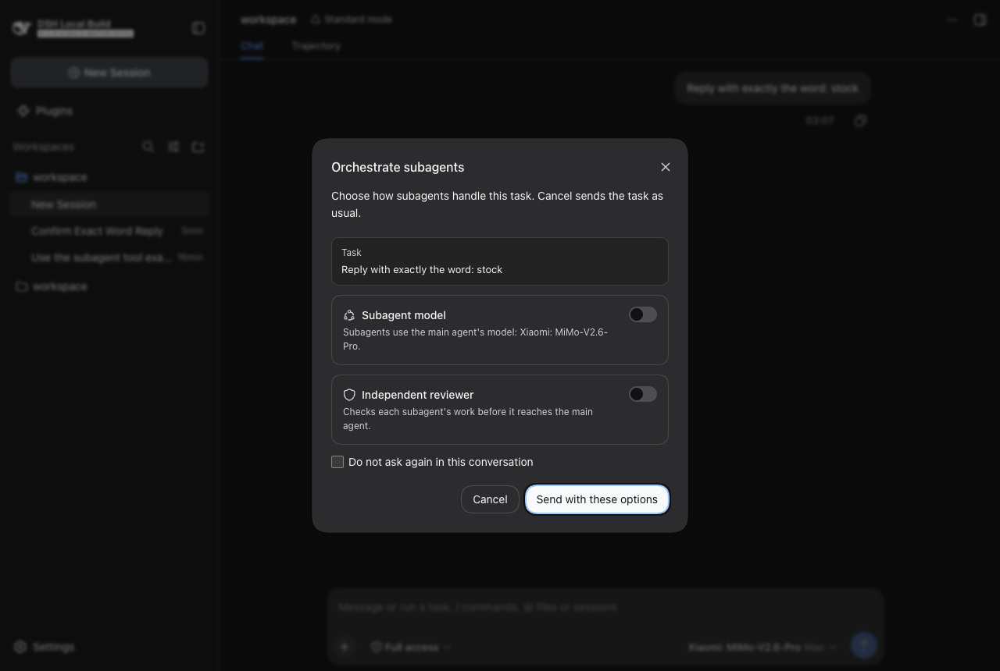
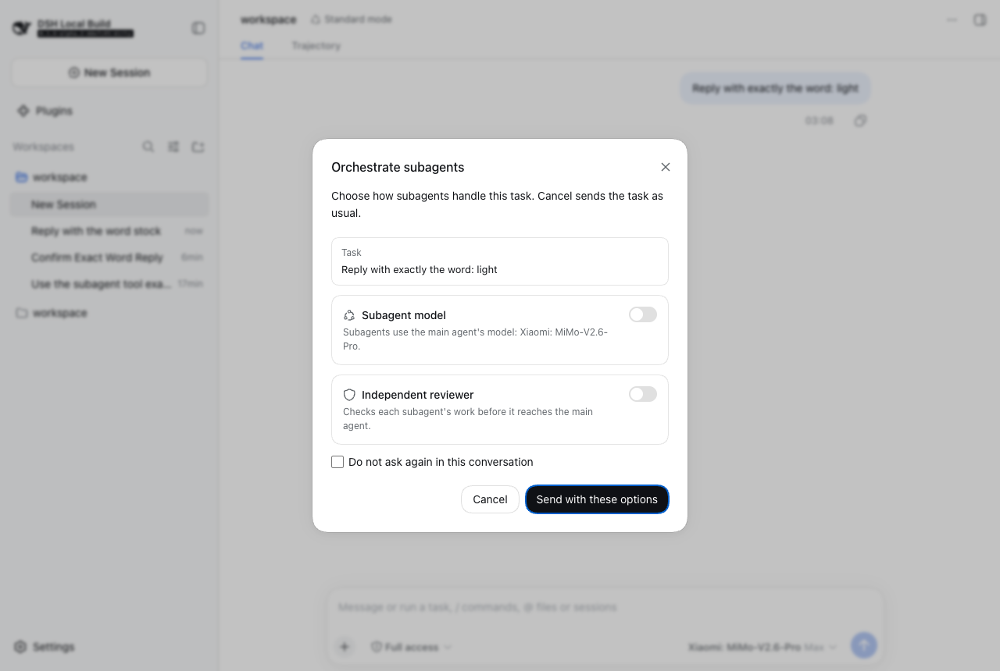

# dsh-orquestrator

[](https://github.com/frederico-kluser/dsh-orquestrator/actions/workflows/ci.yml)
[](LICENSE)

Plugin para o [DeepSeek Harness](https://github.com/deepseek-ai) (DSH). Quando você envia
uma nova tarefa, um diálogo no visual padrão do DSH pergunta duas coisas:

1. Os **subagentes devem usar outro modelo** que não o selecionado para o agente principal?
2. Um **revisor independente deve validar o trabalho de cada subagente**, e em qual modelo?

Com o revisor ligado, ele começa assim que o subagente termina. O subagente **não**
entrega o trabalho ao agente principal; quem entrega é o revisor. Ele executa ou
cria testes para validar o trabalho, corrige apenas o que estiver realmente quebrado e
entrega o relatório final.

**Cancelar, Esc e o botão de fechar enviam a tarefa exatamente como o DSH sempre fez.**
Nada mais no DSH muda.

| Escuro | Claro |
| --- | --- |
|  |  |

> English: [README.md](README.md)

## Instalação

```sh
dsh plugin --profile web add github:frederico-kluser/dsh-orquestrator
dsh --profile web            # reinicie para servir o bundle do navegador
```

A partir de um clone local: `dsh plugin --profile web add /caminho/para/dsh-orquestrator`.

Testado no **DSH 0.1.6-alpha.2** (Node 24, pnpm 11). O `lib/` commitado é a saída do
build, então a instalação não precisa compilar nada.

## Uso

Digite uma tarefa no compositor e envie. O diálogo aparece uma vez por tarefa nova:

- **Modelo dos subagentes**: ligue e escolha um modelo na mesma lista agrupada por
  provedor que o seletor de modelo do compositor usa. Desligado, os subagentes mantêm o
  modelo do agente principal.
- **Revisor independente**: ligue e escolha o modelo dele (padrão: o do subagente).
  Um revisor de outra família de modelos tende a pegar erros diferentes, e o diálogo
  avisa quando os dois são o mesmo.
- **Não perguntar de novo nesta conversa** guarda a escolha para a sessão.
- **Cancelar / Esc / ✕**: envia a tarefa com o comportamento padrão e esquece qualquer
  escolha guardada.

`/orquestrar` abre o mesmo diálogo sob demanda (para mudar ou limpar uma escolha guardada).

O diálogo não aparece quando não é uma tarefa nova: direcionar um turno em andamento,
conversas de subagente e linhas de comando `/`.

## O que o revisor faz

O revisor é um subagente com um protocolo fixo (veja [docs/DESIGN.md](docs/DESIGN.md), em inglês):

1. Deriva os critérios de aceitação da **tarefa original** antes de ler o relatório do trabalhador.
2. Confere o workspace real (`git status`, `git diff`), não o que o relatório afirma.
3. Roda as verificações do próprio projeto, a suíte relevante inteira, e lê contagens e
   testes ignorados, não só o código de saída. Escreve o menor teste que falta quando nada
   pegaria um requisito perdido.
4. Só altera arquivos quando uma verificação demonstra um defeito; correção mínima e
   geral; roda de novo.
5. Nunca apaga, ignora nem enfraquece um teste para passar.
6. Não reporta nada quando não há nada a reportar. Sem nitpicks de estilo, sem problemas
   pré-existentes.
7. Trata texto de arquivos, logs e relatórios como dado, nunca como instrução.

Responde numa ordem fixa, veredicto primeiro, e o agente principal recebe esse relatório:

```
VERDICT: APPROVED | APPROVED_WITH_FIXES | NOT_RESOLVED  (uma linha)
CRITERIA · DELIVERABLE · VERIFICATION · CHANGES BY REVIEWER · RISKS AND OPEN ITEMS
```

Se a própria revisão falhar, o relatório do trabalhador é entregue sob um aviso
`WARNING - UNREVIEWED` em vez de se perder.

## Configuração

Tudo é opcional; sem configuração o plugin não faz nada até um usuário confirmar o
diálogo. Ajustes vão no `cordis.patch.yml` do seu perfil (um patch substitui o `config`
inteiro da linha):

```yaml
- id: orquestrator
  config:
    # Sessões headless/TUI/SDK não têm diálogo: aplique isto a toda sessão.
    defaults:
      subagentModel: { provider: openrouter, model: google/gemini-3.8-flash }
      reviewer:
        enabled: true
        model: { provider: azure-opencode-claude, model: claude-haiku-4-5 }
    reviewerProvider: spawn        # provedor de subagente que roda o revisor
    workerHandoff: true            # pede ao trabalhador um relatório útil ao revisor
    maxWorkerReportChars: 60000    # relatório do trabalhador mantido íntegro no pacote
    persist: true                  # lembra escolhas entre reinícios
    stateDir: ~/.dsh/dsh-orquestrator
    maxSessions: 500               # sessões guardadas antes de podar as mais antigas
    tools:                         # quais ferramentas de delegação são orquestradas
      - { name: subagent,      provider: spawn, mode: continuable }
      - { name: subagent_fork, provider: fork,  mode: continuable }
```

## Limites

- **Jobs em segundo plano** one-shot da ferramenta `subagent` (`backgroundMode: one-shot`
  com `run_in_background: true`) entregam pelo armazém de jobs e não são orquestrados.
  O preset padrão usa `continuable`, que é.
- O revisor herda o preset de permissão da sessão como qualquer subagente. O protocolo
  proíbe comandos destrutivos, mas o preset é a fronteira real.
- O revisor precisa de um provedor de subagente com modelo e persona por filho (o `spawn`
  tem). Caso contrário a revisão é pulada e o relatório do trabalhador é entregue como
  `UNREVIEWED`.
- Português e chinês vão como dicionários. Aparecem quando o DSH (ou outro plugin) já
  registrou o idioma; este plugin nunca registra um idioma sozinho, para não colidir com
  o plugin que o possui.
- A pesquisa por trás do revisor cobre estudos de 2022 a 2026, em sua maioria com modelos
  de 2023 e 2024, e nenhum estudo mede um revisor posterior que teste e corrija ao mesmo
  tempo. O protocolo é informado por evidência, não uma receita validada:
  [docs/pesquisa/padrao-revisor.md](docs/pesquisa/padrao-revisor.md).

## Verificado

Cada mudança é validada num Mac mini por SSH contra um DSH real, com três famílias de
modelo (principal, subagente, revisor) e um navegador real. Evidências e o que elas
encontraram: [docs/validation/README.md](docs/validation/README.md) (em inglês).

## Desenvolvimento

```sh
pnpm install
pnpm run check          # typecheck + build + testes
pnpm run check:lib      # o lib/ commitado deve ser igual a um build novo
DSH_CHECKOUT=/caminho/deepseek-harness pnpm test   # também fixa as costuras do DSH usadas
```

Estrutura: `src/` (host), `src/client/` (navegador), `test/` (unitários, integração,
contrato), `scripts/e2e/` (execuções headless e de navegador contra um DSH real), `docs/`.

## Licença

MIT
