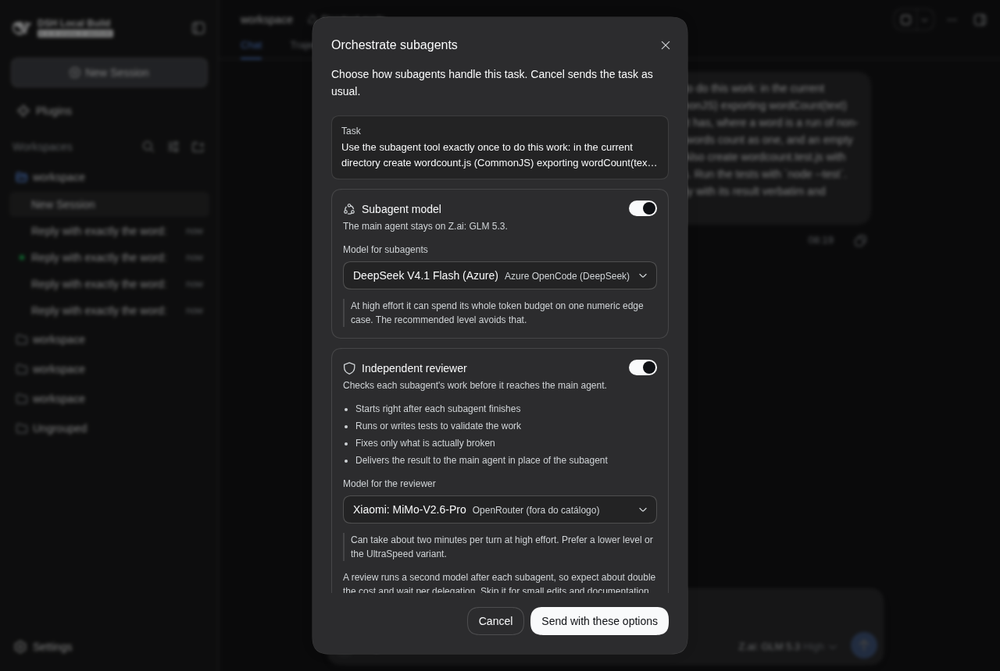
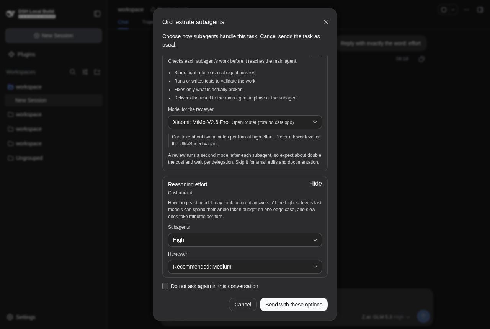
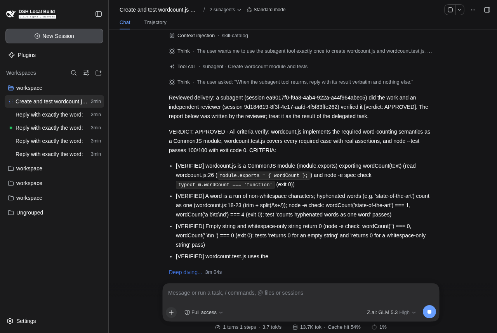
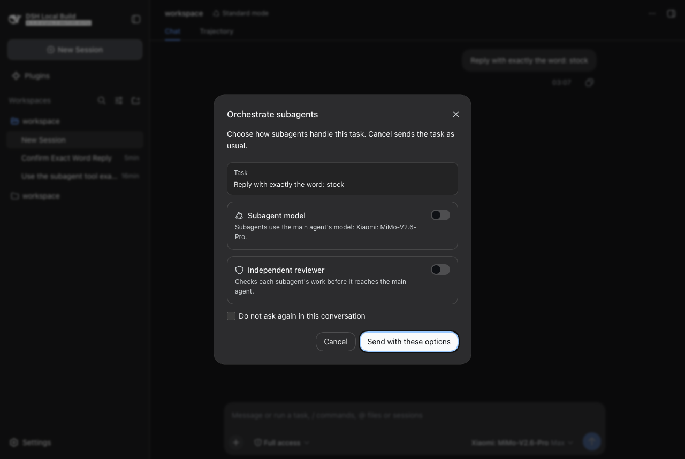
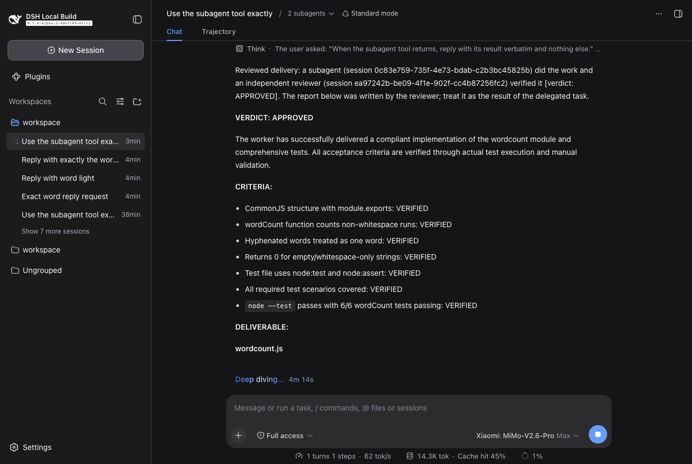

# Validation

Everything in this plugin was validated against a real DeepSeek Harness, not only against
mocks. This page states what was run, what it proved, what it found and what it did not
cover: first the **0.2.0** validation on the three target models, then the **0.1.0**
validation on a Mac mini.

## 0.2.0: the three target models (2026-10-03)

Only three models ever ran, in the roles the studies defined for them.
[`scripts/e2e/run-trio.sh`](../../scripts/e2e/run-trio.sh) enforces it: after every run it
reads the sessions back from the DSH logs and fails (exit 3) if any session ran on another model.
Exploratory runs made earlier on other models were discarded and are not cited.

| Role | Model | Route |
| --- | --- | --- |
| Main agent | GLM 5.3, reasoning `high` | `openrouter/z-ai/glm-5.3` |
| Subagent (worker) | DeepSeek V4.1 Flash | `azure-opencode/DeepSeek-V4.1-Flash` |
| Reviewer | MiMo-V2.6-Pro | `openrouter-extra/xiaomi/mimo-v2.6-pro` |

| | |
| --- | --- |
| Machine | This Linux workstation (CachyOS), not the Mac mini |
| DSH | 0.1.6-alpha.2 from source (`ddefc45`); the plugin installed with `link:` into an isolated `DSH_HOME`; web server on `--port 0` |
| Toolchain | Node 24.19.0, pnpm 11.7.0 |
| Build under test | `lib/index.js` sha256 `e0e707bfaceed781...`, `lib/client.cjs` `e6edd06e36c44b33...`. Two consecutive builds are byte-identical, so the committed `lib/` is reproducible. |
| Tests | 259 of 259 pass with `DSH_CHECKOUT` set, including 17 DSH-source contract tests |
| Browser | Google Chrome (system), headless, driven by `playwright-core` |
| Keys | From the launching shell's environment; never written to a file or a report |

### What each model was asked

Read back from the DSH session logs (`request/header` of each session), not from the plugin's
own logs. The main agent is never touched by the plugin, so it has no output ceiling in its header.

| Run | Worker: effort, max output, time, tool calls | Reviewer: effort, max output, time, tool calls | Review packet | Verdict | Total |
| --- | --- | --- | --- | --- | ---: |
| [**T1**](runs/T1-spec-rules.md) seven easy-to-miss rules | `medium`, 64 000, 28 s, 7 | `medium`, 32 000, 169 s, 16 | facts, report withheld | `APPROVED` | 255 s |
| [**T1, first run**](runs/T1-first-build.md) | `medium`, 64 000, 55 s, 13 | `medium`, 32 000, 253 s, 12 | facts, report withheld | `NOT_RESOLVED` (see below) | 333 s |
| [**T2**](runs/T2-conflict.md) conflicting requirements | `medium`, 64 000, 16 s, 7 | `medium`, 32 000, 70 s, 11 | facts, report withheld | `NOT_RESOLVED` | 112 s |
| [**T3**](runs/T3-readonly-claims.md) read-only question | `medium`, 64 000, 19 s, 8 | `medium`, 32 000, 75 s, 8 | facts, report as untrusted claims | `APPROVED` | 135 s |
| [**T4**](runs/T4-policy-off.md) T1 with ceilings **off** | `max`, 384 000, 63 s, 18 | `max`, 131 072, 128 s, 13 | facts, report withheld | `APPROVED` | 259 s |
| **confirm** (browser, see below) | `medium`, 64 000, 15 s, 5 | `medium`, 32 000, 42 s, 10 | facts, report withheld | `APPROVED` | 185 s |

### What it showed

1. **The ceiling reaches the wire, and without it DSH runs the child at `max`.** T1 to T3 and
   the browser run: DeepSeek V4.1 Flash at `medium` with 64 000 output tokens and MiMo at `medium`
   with 32 000, on routes whose own default is `max` with 384 000 and 131 072. T4 (`effort: false`,
   `limits: false`) is the same task with the plugin out of the way: both children ran at `max` with
   those declared ceilings. That is the root cause in `docs/estudos/sintese.md`, measured instead of read from code.
2. **No speed-up was measured on this small task, and none is claimed.** T1 took 255 s and T4
   259 s end to end; the worker was faster at `medium` (28 s against 63 s, 7 tool calls against
   18), the reviewer was slower (169 s against 128 s). One sample per condition and a task that does not
   provoke a runaway: the ceiling is a guard on the tail (a fast model deliberating one edge case
   until its budget ends, a slow one needing minutes per turn), which these runs did not exercise.
3. **The reviewer found real problems from a clean context.**
   * *T1, first run:* GLM 5.3 wrote `parseDuration('1d 2h 30m 45s') -> 97545` into **its own delegation prompt**
     (the unit table gives 95445). MiMo returned `NOT_RESOLVED`, verified everything else (16 of 16 tests) and put
     the contradiction in the verdict line for the main agent to decide.
   * *T2:* the two requirements cannot both hold. `NOT_RESOLVED`, with both requirements named in the summary
     (persona rule 11), and a failing `node --test` it ran itself.
   * *T1:* MiMo wrote its own 62-assertion conformance check and a mutation check to confirm the worker's tests can
     actually fail (persona rule 6), then approved and changed nothing.
4. **`reviewerContext: auto` chose the right mode in both directions.** Where files changed (T1, T2, T4) the packet
   carried the measured change list, flagged the test file and withheld the worker's report. In T3 nothing changed
   (`git status` clean afterwards), so the worker's answer went in as untrusted claims and the reviewer verified it by
   reading the source and running `parseConfig`.
5. **The structured report works with all three roles on a real DSH.** The reviewer session carries DSH's
   `structured_output` tool, calls it, and the main agent receives the plugin's verdict-first rendering under the
   `Reviewed delivery` banner. No run needed the text fallback.
6. **The main agent at `max` is outside the plugin's reach.** A first attempt with GLM 5.3 as main agent at `max` gave no
   first tool call in 8.4 minutes and was stopped; at `high` the same task was delegated in about 10 seconds. The plugin
   never changes the main agent's options (documented), so this is a configuration note, in line with study E01, which
   recommends `high` for GLM 5.3.
7. **Runner lessons.** The browser GUI creates its sessions in the last workspace the DSH home registered, so a headless run
   and a browser run started together share one working tree (it corrupted a T4 attempt, which was discarded and
   rerun alone). `session-config.mjs` now filters by the run's main session.

### The browser, on the same three models

Against a real `dsh web` and the main agent GLM 5.3. Reports: [`reports/0.2.0/`](reports/0.2.0).

| Phase | Checks |
| --- | --- |
| `effort` (19) | No effort block while both switches are off; it appears collapsed with "Recommended level for each model". DeepSeek V4.1 Flash shows "Recommended: Medium" (its route defaults to `max`), GLM 5.3 as reviewer "Recommended: Low" (its ladder is low, high, max) with the text-only note, MiMo-V2.6-Pro "Recommended: Medium" with the slow-at-high-effort note. The reviewer cost hint. The same-model tip when worker and reviewer are DeepSeek V4.1 Flash, including across two routes (Azure and DeepSeek's own API). An explicit "High" for the subagent marks the block as customized and reaches the host with 200 (`workerEffort: "high"`, reviewer effort `null`). |
| `confirm` (13) | Models picked from the live catalog (DeepSeek V4.1 Flash, MiMo-V2.6-Pro); the choice is stored (200); the main agent runs the task and receives a `Reviewed delivery` result with a verdict. |
| `cancel` (11) | The modal appears on a new task; Escape sends it as stock DSH and stores `null`. |
| `command` (6) | `/orquestrar` opens the dialog in configure mode; Save persists; the next task is sent without a modal. |
| `light` (5) | Light theme; Tab never leaves the dialog; Escape closes an open menu first. |
| `small` (3) | At 1024x600 with both sections open the dialog fits and its actions stay visible. |

| Subagent and reviewer chosen | Effort, explicit pick | Delivered to the main agent |
| --- | --- | --- |
|  |  |  |

### Not covered

* A token-limit stop was never provoked on a real model, so the one-level-lower retry is covered by unit tests only.
* No model skipped the structured tool, so the verdict-first text fallback is covered by unit tests only.
* Provider `fork`, the TUI and SDK profiles, and macOS (the 0.2.0 runs were on Linux).
* One sample per condition: the timings above illustrate, they do not measure.
* DeepSeek's own API (`deepseek-official`) was not called by any run; Azure served DeepSeek V4.1 Flash.

## 0.1.0 on a Mac mini (2026-09-30 to 2026-10-02)

### Environment

| | |
| --- | --- |
| Machine | Mac mini M1, macOS 15.7.9, reached over SSH |
| DSH | 0.1.6-alpha.2 from source (`ddefc45-dirty`), the plugin installed by `link:` and, separately, by `github:frederico-kluser/dsh-orquestrator` |
| Toolchain | Node 24.19.0, pnpm 11.23.0 |
| Isolation | A separate `DSH_HOME` (`/Volumes/Ext2TB/dsh-orq-validation/home`); the web server on `--port 0`. The DSH already serving port 3080 was never touched. |
| Models | main `openrouter-extra/xiaomi/mimo-v2.6-pro` (the machine's default); subagent `openrouter/google/gemini-3.8-flash`; reviewer `azure-opencode-claude/claude-haiku-4-5`. Three model families. |
| Browser | Google Chrome (system), headless, driven by `playwright-core` |

The scripts are in [`scripts/e2e/`](../../scripts/e2e). The per-phase JSON reports are in
[`reports/`](reports), the screenshots in [`screenshots/`](screenshots), and one
Markdown summary per headless run in [`runs/`](runs).

### What was checked

#### 1. Build and tests on the target machine

`git clone` from GitHub, `pnpm install --frozen-lockfile`, `pnpm run build`, then the
whole suite with `DSH_CHECKOUT` pointing at that machine's DSH source.

- The committed `lib/` is byte-identical to a fresh build on a second machine
  (`git status` clean after building).
- Unit and integration tests pass, and the contract tests pin the DSH internals the
  plugin depends on: the `tools/execute` waterfall and its result re-validation, the
  subagent tool's output schema, `SubagentRuntime` (`start`, `startContinuable`,
  `resolveMaxDepth`, `getProvider`), `SessionFace.prompt`, the composer overlay slot,
  the primitives and their props, and the shell's module table.

#### 2. Real delegation, headless ([`runs/`](runs))

Main agent `openrouter-extra/xiaomi/mimo-v2.6-pro`, worker `openrouter/google/gemini-3.8-flash`,
reviewer `azure-opencode-claude/claude-haiku-4-5` (three families). Each run is a fresh
git workspace and a real `dsh --profile headless` process.

| Run | Outcome |
| --- | --- |
| [**A**](runs/A-reviewed.md) worker + reviewer | 396 s. The main agent's `subagent` call was intercepted at the root context; a worker child ran on Gemini and a reviewer child on Haiku; the tool result the main agent received was the **reviewer's** report under `Reviewed delivery ... [verdict: APPROVED]`, and the worker's own report did not reach it. Re-running the tests independently in the workspace: 6 of 6 pass. |
| [**B**](runs/B-model-only.md) model only | 266 s. Only the child's model changed (Gemini); the main agent received the worker's own result, as stock. |
| [**B2**](runs/B2-background.md) model only, background | 162 s. The `continuable` path: the main agent got `started subagent ...`, the child ran on Gemini, and the main agent later reported the file's content. |
| [**C**](runs/C-stock.md) stock | 67 s. Plugin loaded with an empty config: the child ran on the **main agent's** model and delegation behaved exactly like stock DSH. |
| [**D**](runs/D-reviewer-fixes.md) seven easy-to-miss rules | 612 s. The worker met them all; the reviewer verified and returned `APPROVED` without inventing defects. |
| [**D2**](runs/D2-final.md) same task | 658 s. The worker ran out of tokens; the plugin reported it as the stock tool does (`subagent run hit its token limit ...`) and did **not** start a reviewer. |
| [**E**](runs/E-unreviewed.md) reviewer cannot start | 124 s. The main agent received `WARNING - UNREVIEWED: the independent review did not complete ...` followed by the worker's raw report. |
| [**F**](runs/F-planted-defect.md) planted defect | 381 s. The request pushed the worker into a wrong `fizzbuzz` (15 gives `Fizz`) and forbade tests. The reviewer ran `fizzbuzz(15)`, saw the wrong output, named the contradiction, and still returned `APPROVED` because the request said the build style took precedence. **A real defect in the protocol, fixed (finding 7).** |
| [**F2**](runs/F2-conflict-rule.md) same task, new rule | 159 s. `VERDICT: APPROVED_WITH_FIXES`: the reviewer reordered the chain to 15, 3, 5 and reported the departure from the style rule. The main agent received the reviewer's report. |

#### 3. The dialog, in a real browser against the real web server

| Phase | Checks |
| --- | --- |
| `cancel` (11) | The modal appears on a new task from the composer; title, description, task preview, two switches off, checkbox unchecked, primary action focused; **Escape sends the task as stock DSH** and stores `null`; no page errors. |
| `confirm` (13) | Choose the subagent model and the reviewer model from the composer's own catalog; confirm is disabled until a model is chosen; the choice is stored (200); the main agent runs the task and receives a `Reviewed delivery` result with a verdict. |
| `light` (5) | Light theme; Tab never leaves the dialog; Escape closes an open menu first and the dialog on the next press. |
| `command` (6) | `/orquestrar` opens the dialog in configure mode; Save persists reviewer and "do not ask again"; the next task is sent without a modal. |
| `small` (3) | At 1024x600 with both sections open the dialog fits, its body scrolls, and the actions stay visible. |

| Dark, empty | Dark, filled | Delivered to the main agent |
| --- | --- | --- |
|  |  |  |

#### 4. UX self-audit

Applied the uxuiprinciples framework (no API key, so from internal knowledge and
without citations; a self-assessment, not an independent audit):
[before](uxui-audit-before.json) scored 80 (good), [after](uxui-audit-after.json) scored 94
(excellent) once the two warnings were fixed.

### What validation found, and what changed

Each of these was invisible to the mocks and surfaced only on the real DSH:

1. **`cannot get property "remote" without inject`.** The catalog loader touched
   `ctx.remote`, which Cordis refuses for a plugin that did not inject it. DSH isolated
   the crash (`slot entry crashed in 'conversation.input.overlay'`) and the task went
   out as stock DSH, which confirmed the fail-open design, but the modal never showed.
   Sources are now resolvers evaluated inside the loader's error handling, using `ctx.get`.
2. **No focus containment.** The host `Modal` declares `aria-modal` but does not trap
   Tab; every Tab left the dialog. A small focus trap (paused while a menu portal owns
   the keyboard) fixes it without touching the host.
3. **The picker's current value was hidden from screen readers.** A `<label for>` named
   the button by its label alone. The button is now named by label plus value
   (`aria-labelledby`).
4. **Reviewer format drift on a smaller model.** Haiku echoed the persona's lettered
   procedure steps ("D.", "E.") as headings and narrated its analysis before the
   report. The persona no longer labels steps and forbids working notes in the final
   message, and the pipeline drops a preamble before the verdict line when a full report
   follows it.
5. **A worker went digging in DSH's storage for reviewer traces.** The handoff contract
   mentioned the reviewer; it now says only that the message "will be checked against the
   workspace by someone else".
6. **Copy.** Double colons ("model: Xiaomi: MiMo") and a switch whose ON meaning was
   only discoverable by toggling.
7. **A reviewer approved a result whose behavior was wrong** (scenario F). Instruction
   priority explained the failure, and the caveat sat in the middle of the report where
   a top-only reader would miss it. The persona now says a conflict between requirements
   is not a pass: a failed behavior is a FAILED criterion and cannot be approved; the
   reviewer fixes it minimally and reports the departure, or returns `NOT_RESOLVED` with
   the conflict named in the verdict line. Scenario F2 re-ran it on the new build.
8. **Runner bugs, not plugin bugs.** An empty profile overlay is not a valid patch (it
   must be `[]`); `git pull` aborted over files copied by hand; a burst of 36 parallel
   research verifiers exhausted the search API's key pool (see the dossier, section 8).

### Revalidation after the search-key reset (2026-10-02)

The research verification had been left incomplete because the search API keys were
exhausted. After the keys were reset, everything done on the Mac mini was checked again
from a clean state, and the research step was finished (see the dossier, sections 3, 4 and 8).

| Check | Result |
| --- | --- |
| Machine doctor (G1-G8: SSH key, sudo, root SSH, TCC, sshd, volume) | all green |
| Sync before checking | this machine, GitHub and the Mac mini all at `89b3408` (0 ahead, 0 behind) |
| Mac mini: `pnpm install --frozen-lockfile`, `pnpm run build` | `git status` clean afterwards, so the committed `lib/` is reproducible; `check-lib` passes |
| Mac mini: full suite with `DSH_CHECKOUT` | 136 of 136 pass, including the 11 DSH-source contract tests |
| Install straight from GitHub (`pnpm add github:frederico-kluser/dsh-orquestrator`) | `lib/index.js` and `lib/client.cjs` are byte-identical to the committed ones (sha256 `3eef6576...` and `c1f85117...`) |
| Isolated DSH home after deleting the credentials copy | still boots and answers (keys come from the environment) |
| Browser phases against the real web server, [`reports/revalidation/`](reports/revalidation) | cancel 11, light 5, command 6, small 3, confirm 13: 38 of 38, no page errors |
| Headless run on the final build ([`runs/A2-final.md`](runs/A2-final.md)) | worker on Gemini, reviewer on Haiku, `Reviewed delivery ... [verdict: APPROVED]`, verdict-first report, 327 s |

### Not covered

- Profiles other than `web` and `headless` (TUI, SDK).
- One-shot `subagent` background jobs are not orchestrated by design.
- Only macOS/arm64 was exercised end to end; the code has no platform-specific paths.
- A reviewer that repairs is measured on the runs above, not on a benchmark. The
  research dossier says why no published study settles that question.
